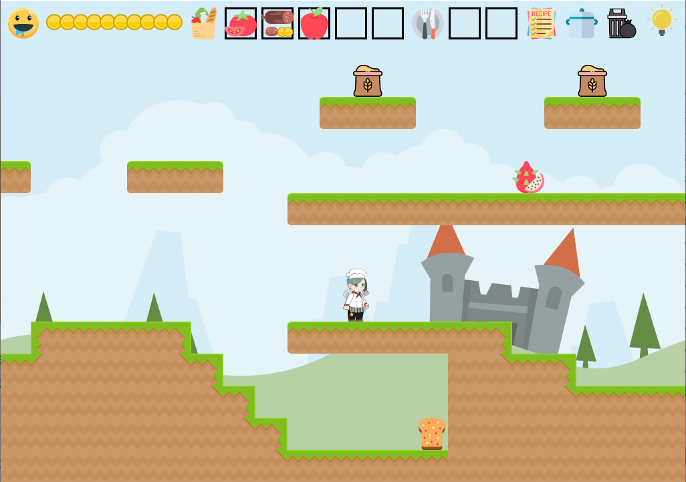
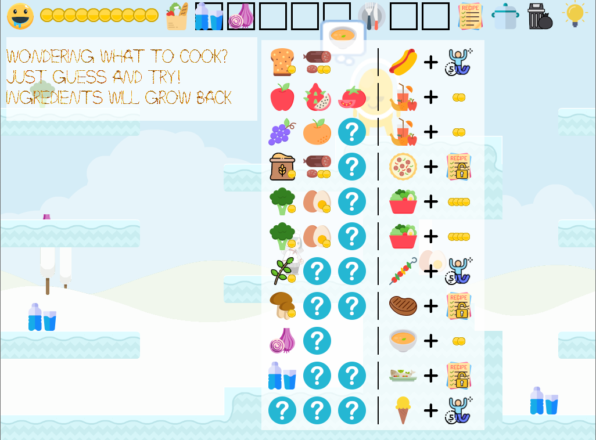
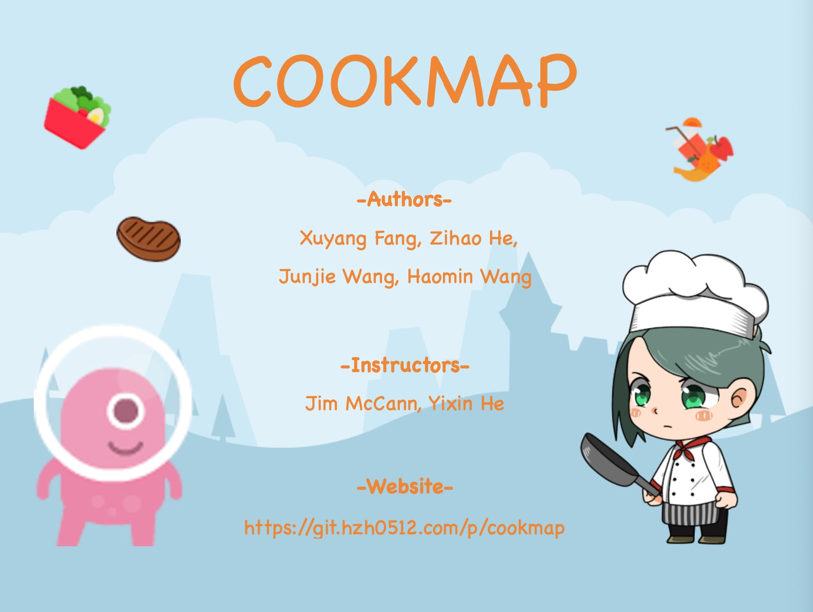

<iframe width="560" height="315" src="https://www.youtube.com/embed/mA3wqXsRHHI" frameborder="0" allow="accelerometer; autoplay; encrypted-media; gyroscope; picture-in-picture" allowfullscreen></iframe>

# Description

This is a 2D adventure game where the player has to collect ingredients, try out different recipes, bribe greedy aliens and find the ultimate delicacy.

# Facesheet

* Developer: Xuyang Fang, Junjie Wang, Haomin Wang, Zihao He
* Release date: December 4th, 2019
* Platforms: Mac, Windows, Linux
* Website: [https://git.hzh0512.com/p/cookmap](https://git.hzh0512.com/p/cookmap)

# Screenshots

# Logos

# Assets Credit

Chef character asset is purchased from [Unity Asset Store](https://assetstore.unity.com/).

Enemy and background asset are purchased from [Kenney](https://kenney.nl/).

All icon assets are purchased from [flaticon](https://www.flaticon.com/).

All music assets are downloaded from [freepd](https://freepd.com/) and [freesound](https://freesound.org/).

The rope font comes from [sourceforge](https://sourceforge.net/projects/rods-custom-font-xcf-files/).

This game was built with [NEST](https://github.com/yy9669/CookMap/blob/master/NEST.md).

# Contact

Email: <a href = "mailto:i@hzh0512.com?subject=Feedback about CookMap">i@hzh0512.com</a>

last update: 12/4/2019