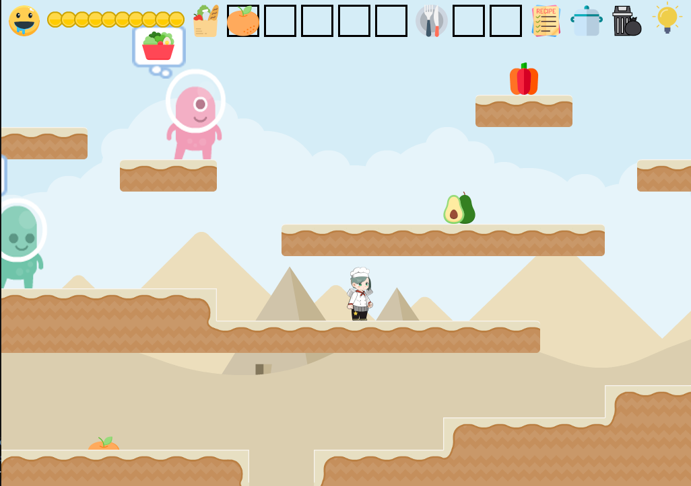

<iframe width="560" height="315" src="https://www.youtube.com/embed/5hdXsl1ZsW8" frameborder="0" allow="accelerometer; autoplay; encrypted-media; gyroscope; picture-in-picture" allowfullscreen></iframe>

# Description

This is a 2D adventure game where the player has to collect ingredients, try out different recipes, bribe greedy aliens and find the ultimate delicacy.

# Facesheet

* Developer: Xuyang Fang, Junjie Wang, Haomin Wang, Zihao He
* Release date: December 4th, 2019
* Platforms: Mac, Windows, Linux
* Website: [https://git.hzh0512.com/p/cookmap](https://git.hzh0512.com/p/cookmap)

# Screenshots

# Contact

Email: <a href = "mailto:i@hzh0512.com?subject=Feedback about CookMap">i@hzh0512.com</a>

last update: 12/4/2019