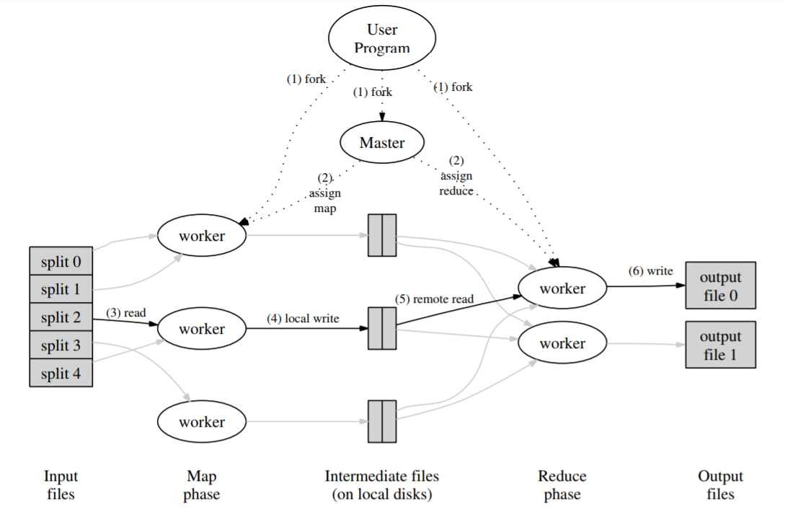
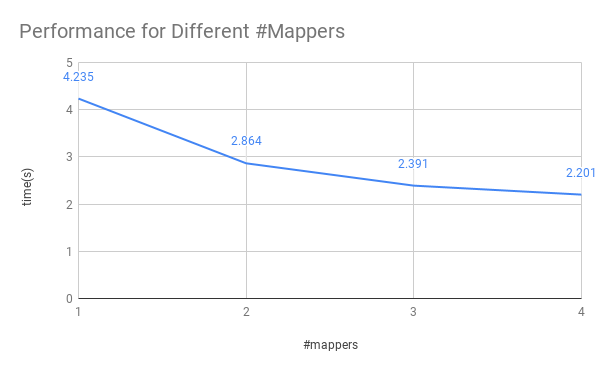
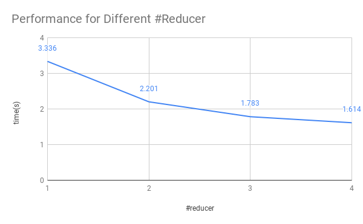
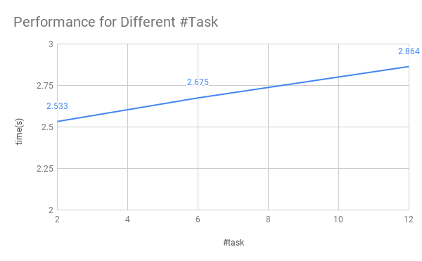

* Project repository: [here](https://github.com/hzh0512/Lightweight-MapReduce)
* Project proposal: [here](../assets/files/proposal.pdf)
* Project checkpoint: [here](../assets/files/checkpoint.pdf)

# Summary

We are going to implement a lightweight MapReduce framework using C++, and demonstrate some machine learning algorithms on top of it.

# Background

image credit: Dean, Ghemawat

As big companies are collecting more and more data (e.g. logging info, clicking data, social network info etc.) from users, they are facing a tough problem of dealing with a large amount of data. The processing and analyzing tasks require huge computation power from hundreds or even thousands of computers. Many of the problems are pretty straightforward such as word counting, naïve bayes classification etc., and the intrinsic difficulty instead becomes how to distribute and parallelize the workload efficiently. To focus on the business logic itself instead of the general parallelism problem, Jeffreay Dean etc. proposed a programming model named MapReduce, where users specify a *map* function to generate a set of intermediate key/value pairs, and a *reduce* function to merge all intermediate values with the same key (see diagram above). It turns out that many real world problems can be expressed in this model. And this idea enables great convenience for programmers without any experience with parallel systems to write highly scalable programs.

Our 15618 project is to implement such a MapReduce framework that will take care of the details of partitioning the input data, scheduling and distributing tasks and so on. It is lightweight because it *does not* handle unexpected situations such as machine failures, network interruptions or hard drive problems etc, and it will take advantage of existing distributed file system for sharing partial results. The framework will support dynamic work distribution by assigning one master which saves the task states and controlling the rest workers.

# Preliminary Result
The following result are tested on a localhost with a quad-core Intel i5-8267u CPU.

## Different Number of Mappers
The number of reducers is 2, and the number of tasks is 12.

## Different Number of Reducers
The number of mappers is 4, and the number of tasks is 12.

## Different Number of Tasks
The number of mappers is 2, and the number of mappers is 2.

# Challenges

* Workers are doing separate tasks and there are no synchronizations during the task. Messages are transmitted asynchronously when the task is done, thus we are not using OpenMPI or OpenMP. We need to implement a set of Low-level asynchronous communication functions through TCP/IP.
* How to distribute the workload smartly and efficiently? How to exploit the locality that some Map workers are on the same machine as other Reduce workers?
* What messages are transmitted during the communication? How to reduce the amount of data transmitted each time and how to lower the times of communication?
* Can we not store the result onto the hard drive? How to make use of the memory which is 100x faster than accessing the hard drive?

# Resources

* Personal laptops can be used for developing. Moreover, GHC26-46 machines could be used for testing for scalability. During the 5-min feedback, Dr. Mowry mentioned we could use the `Bridges` cluster at the Pittsburgh Supercomputing Center and *we are interested in getting access to it*.
* The [paper](https://research.google.com/archive/mapreduce-osdi04.pdf) from Google is our reference.
> J. Dean and S. Ghemawat, MapReduce: Simplified Data Processing on Large Clusters. Communications of the ACM, 2008
* A word counting implementation on a single machine on [Github](https://github.com/cdmh/mapreduce). Another implementation with static scheduling pattern on [Github](https://github.com/wangkuiyi/mapreduce-lite).
* Several ML algorithms implementated in MapReduce are mentioned in this [paper](https://papers.nips.cc/paper/3150-map-reduce-for-machine-learning-on-multicore.pdf). 
> C. Chu etc., Map-Reduce for Machine Learning on Multicore. Proceedings of the 19th International Conference on Neural Information Processing Systems, 2006
* Furthermore, some implementation in Python can be found [here](https://github.com/AmazaspShumik/MapReduce-Machine-Learning). Another implementation in Hadoop is [here](https://github.com/punit-naik/MLHadoop).

# Goals and Deliverables

* [75%] Implement the framework with static workload assignment and demonstrate with word counting.

* [100%] Implement dynamic assignment and demonstrate with word counting.

* [125%] Implement parallel machine learning algorithms as built-in functions.

* During the poster session, we can show the speedup graph of some algorithms comparing our performance with single-threaded version and see how it gets scalable with more machines. What's more, we can show the programming codes with our framework, which should be concise and easy to read.

* As a system project, we'd like the framework user should not care much about how the parallelism work in details and focus more on making business or analyzing work. The performance should scale with more computers.

# Platform Choice

We decide to use C++ and focus on Linux. Because C++ is highly efficient compared with Java, the STL and thread/chrono standard libraries give us enough flexibility, and libevent/protobuf libraries make it more portable and convenient for asynchronous network communication and serialization. Linux is the mainstream operating system in servers and supercomputers.

# Schedule

* Week 1 (Until 11/4): Read the Google paper and be familiar with existing code on Github.

* Week 2 (Until 11/11): Implement low-level TCP/IP asynchronous communication protocol.

* Week 3 (Until 11/18) (11/19 Checkpoint): Finish basic functionality of the MapReduce framework with static work assignment and demonstrate with word counting example program.

* Week 4 (Until 11/25): (1) Zihao: further test the static version. (2) Shiming: test on more optimized work distribution designs.

* Week 5 (Until 12/2): (1) Both: optimize the framework and read papers about machine learning implementations on MapReduce framework. (2) Both: implement some mahine learning algorithms.

* Week 6 (Until 12/9): Both: test on the performance of ML algorithms.

* Week 7 (Until 12/16) (12/15 Final Report): Both: write the final report.