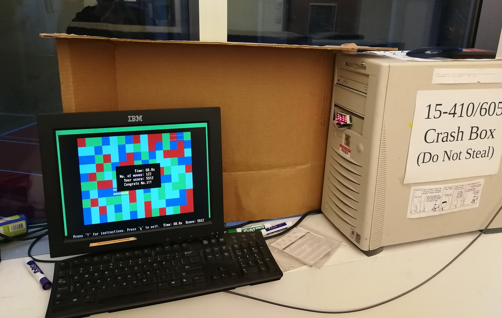

<iframe src="https://www.youtube.com/embed/fPv7E1FX4eQ" frameborder="0" allow="accelerometer; autoplay; encrypted-media; gyroscope; picture-in-picture" allowfullscreen class="video"></iframe>

**No source code is released due to the CMU policy.**

# Description

PebPeb is an educational operating system written from scratch as the final project of CMU 15-410/605 *Operating System Design and Implementation* ([course website](https://www.cs.cmu.edu/~410/)). 

It's a monolithic kernel on Intel x86 platforms including user processes, threads, virtual memory management, console/timer/keyboard drivers and para-virtualization. A user-level thread library was developed on top of the system calls which implemented mutex, condition variable, semaphore and r/w lock. PebPeb, as its name suggests, provides a way to run itself as a guest kernel. To do that, we implemented shadow page table, hypercalls, virtual interrupts and virtual console which enables running multiple programs/guest kernels in different shells and switching between shells using the <TAB> key. The video shown above demonstrates the ability to play gomoku and run intensive tests at the same time.

# Beswapped on a crashbox

The kernel image was burned onto a CD-RW disc and booted on a machine with two 400 MHz Pentium-II Xeon processors, 512 megabytes of RAM, a floppy drive, and a CD-ROM (no disk or network).

last update: 12/6/2019
